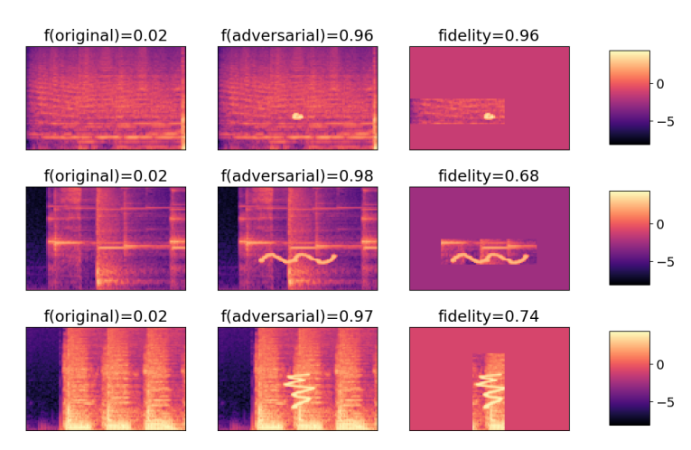
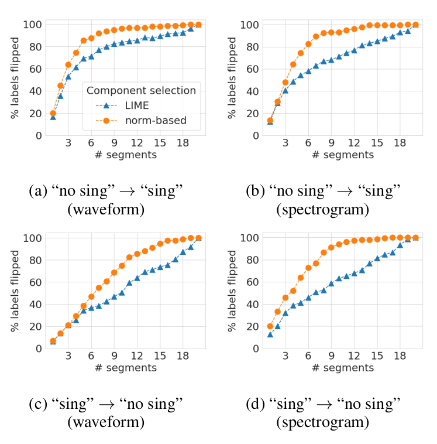
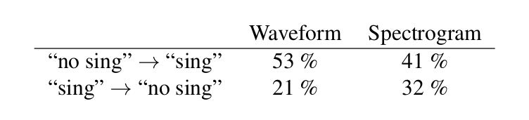
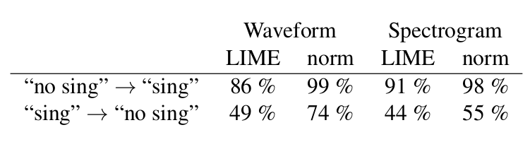
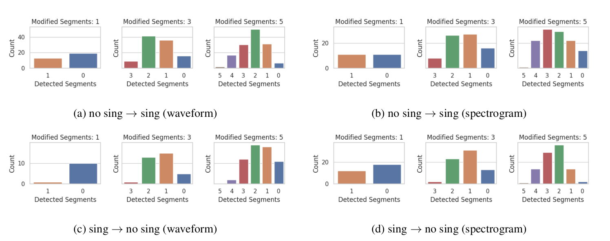
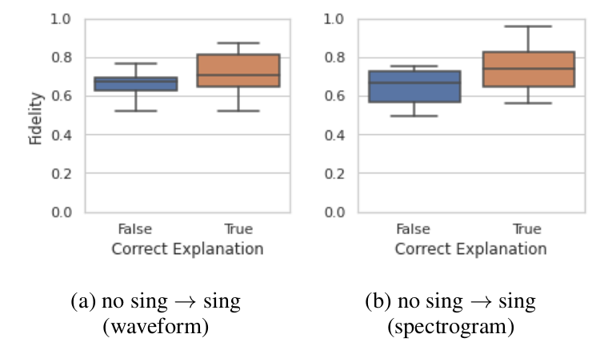

On the Veracity of Local, Model-agnostic Explanations in Audio Classification
==================================

This repository accompanies the publication: Verena Praher&ast;, Katharina Prinz&ast;, 
Arthur Flexer, and Gerhard Widmer, 
"On the Veracity of Local, Model-agnostic Explanations in Audio Classification: Targeted Investigations with Adversarial Examples". 

(*) equal contribution.

The steps in this README describes how the results can be reproduced in the following steps:

* [Setup](#setup)
* [Training the Singing Voice Detector](#training)
* [Computing Adversaries](#computing-adversaries)
* [Computing Explanations](#compute-explanations)
* [Tables and Visualizations in the Paper](#tables-and-visualizations-in-the-paper)

The code was restructured after submission for better readability and we removed some code that
was only used for exploration. If you think something is not working as it should be, please let
us know :)

## Setup <a name="setup"></a>

The required Python libraries can be found in [environment.yml](environment.yml). In addition
you need to install [audioLIME v0.0.3](https://github.com/CPJKU/audioLIME/tree/v0.0.3) by running:

`pip install git+https://github.com/CPJKU/audioLIME.git@v0.0.3#egg=audioLIME`

Before running the code, please set the variables `project_root` (results will be stored there) and 
`dataset_path` in `svd/path_config.py`.

Copy the model `model_log_0mean/model.pt` into the directory <experiments_path>, such that the
path to the model is <experiments_path>/model_log_0mean/model.pt.

### Data

As in the original work of the singing voice detector [1] we use the Jamendo dataset [2] 
for our experiments. If you want to use this data as well, you can download the data 
[here](https://www.ismir.net/resources/datasets/) by choosing the dataset called *Jamendo-VAD*. 

Extracting the archive should give you three folders `audio` (containing the audio), 
`filelist` (containing the train/validation/test splits) and
`labels` (containing the annotations for every song). These folders should be moved into `dataset/jamendo`,
in which already a folder `models` (containing a pretrained model) should be located.


## Training the Singing Voice Detector <a name="training"></a>

This work is based on the Singing Voice Detector proposed by Schlüter and Lehner [1]. 
Our code is therefore strongly based on [this repository](https://github.com/f0k/ismir2015/).

### Training

For training a singing voice detector, you can call e.g., 
```
python -m svd.train dataset/jamendo/models/new/model.pt --dataset-path=dataset/jamendo/audio --validate --save-errors 
```

Here you first need a path to where you want to store the new model at, and a valid
path pointing to the data. The remaining arguments used above indicate that we compute
the validation error during training, and that errors for different epochs are stored. 
For more information and the remaining available arguments, see `svd/train.py`. 

Hyperparameters for training can be configured e.g., by modifying `svd/default.vars`.

### Prediction

To compute predictions for validation (and test) data, run
```
python -m svd.predict dataset/jamendo/models/model_log_0mean/model.pt dataset/jamendo/models/model_log_0mean/pred.npz --dataset-path=dataset/jamendo/audio --vars=dataset/jamendo/models/model_log_0mean/model.vars
```

Here the first path should point to the file where the model weights have been stored
at. Make sure you also use the same configurations as during training, e.g., 
by passing an appropriate `vars` file .

Furthermore, an `.npz` file to store the predictions in is required. Also adapt the path
pointing to the data if necessary. For more information about all remaining arguments, 
see `svd/predict.py`.

### Evaluation

To evaluate previously obtained predictions, you can call e.g.,
``` 
python -m svd.eval dataset/jamendo/models/model_log_0mean/pred.npz --dataset-path=dataset/jamendo/audio --auroc
```
This call requires the path to the file where the predictions were stored previously,
and again the path pointing to the data. `--auroc` computes the area under the receiver operating characteristic
in addition to other metrics. For more information on the remaining arguments, see `svd/eval.py`.


### Model Performances

The final classification error of the singing voice detector (in percent) on the Jamendo test data, 
given as the mean ± standard deviation over 5 different runs, is 11.54 ± 0.96. 
Furthermore, recall and specificity over
5 runs are 89.61 ± 1.71 and 87.46 ± 1.00 respectively.

## Computing Adversaries <a name="computing-adversaries"></a>

### Adversaries on the Raw Audio Waveform

To compute adversaries on the raw waveform, you can call e.g., 
```
python -m svd.adversaries.raw_attack dataset/jamendo/models/model_log_0mean/model.pt --adv-dir=dataset/jamendo/adversaries --dataset-path=dataset/jamendo/audio --vars=dataset/jamendo/models/model_log_0mean/model.vars --test --threshold=0.51 

```

The most important parameter is the first one, where the path to the model under attack should
be stated. The second required parameter is the path to where the adversarial examples should be stored.
Finally, please also set the path to where the data is located, and define the model parameters 
accordingly (e.g., here we linked the file containing variables we used during training).

The remaining two arguments
in this example are `--test`, which indicates that we compute adversaries for test-data
instead of validation data, and `--threshold`, which is an optimised threshold for classifying
singing voice with the pre-trained model we provide. 

For more details and a complete set of parameters, please refer to `svd/adversaries/raw_attack.py`. 
Note that per default, the attack parameters defined in `adv_default.vars` are used - 
feel free to change them!

### Adversaries on the Spectrogram

To compute adversaries on the spectrogram instead, change the above command as follows:
```
python -m svd.adversaries.spec_attack dataset/jamendo/models/model_log_0mean/model.pt --adv-dir=dataset/jamendo/adversaries --dataset-path=dataset/jamendo/audio --vars=dataset/jamendo/models/model_log_0mean/model.vars --test --threshold=0.51 
```

Once more, the attack parameters are defined in `adv_default.vars`, and all arguments
to run the attack are as for the attack on raw audio (see `svd/adversaries/raw_attack.py`).


##### Disclaimer
Note, that the success rate of the adversarial attacks is relatively low when looking
at the number of excerpts we successfully flipped. We assume that this is due to the fact
that we decided to store entire adversarial songs instead of adversarial excerpts;
that way, we make adversarial changes at a file-level, but have our adversarial
targets at an excerpt-level. In other words, a single change to the file can 
influence multiple overlapping excerpts at the same time.


## Computing Explanations <a name="computing-explanations"></a>


### Compute Explanations for Horses

We stored a set of spectrograms, for which we modified the prediction from "no sing"
to "sing" by drawing on them, in `horses/horses1.pt`, `horses/horses2.pt`, and `horses/horses3.pt`.

To compute explanations, call:

```
python -m svd.explanations.compute_and_store_horse_explanations --which_horses horses1 --baseline mean
python -m svd.explanations.compute_and_store_horse_explanations --which_horses horses2 --baseline mean
python -m svd.explanations.compute_and_store_horse_explanations --which_horses horses3 --baseline mean
```

### Compute Explanations for Adversarial Examples

First pick 10 adversaries per attack type (spec/wave) and adversarial direction 
(sing &rarr; no sing; no sing &rarr; sing).

```
python -m svd.explanations.pick_and_store_adversaries --attack_type wave --subset test --target 1
python -m svd.explanations.pick_and_store_adversaries --attack_type spec --subset test --target 1
python -m svd.explanations.pick_and_store_adversaries --attack_type wave --subset test --target 0
python -m svd.explanations.pick_and_store_adversaries --attack_type spec --subset test --target 0
```

To compute explanations for the selected adversarial examples, run the following:

```
python -m svd.explanations.compute_and_store_explanations --attack_type spec --subset test --baseline mean --target 1
python -m svd.explanations.compute_and_store_explanations --attack_type wave --subset test --baseline mean --target 1
python -m svd.explanations.compute_and_store_explanations --attack_type wave --subset test --baseline mean --target 0
python -m svd.explanations.compute_and_store_explanations --attack_type spec --subset test --baseline mean --target 0
```

## Tables and Visualizations in the Paper <a name="tables-and-visualizations-in-the-paper"></a>

Here we summarize how to reproduce the figures and tables in our paper 
and the main conclusions:

* Figure 1: "Obvious" causes for predictions can be detected with high fidelity.

To reproduce the figure, run:

```
python -m svd.visualizations.create_horse_figure --which_horses horses1 --horse_index 1
python -m svd.visualizations.create_horse_figure --which_horses horses2 --horse_index 6
python -m svd.visualizations.create_horse_figure --which_horses horses3 --horse_index 4
```



* Figure 2: When using a varying number of interpretable features, we detect fewer "correct" 
  segments than when simply taking the same number of segments with the highest magnitude.

To reproduce the figure, run:

```
python -m svd.visualizations.create_flip_count_figure --attack_type spec --subset test --baseline mean --target 0
python -m svd.visualizations.create_flip_count_figure --attack_type spec --subset test --baseline mean --target 1
python -m svd.visualizations.create_flip_count_figure --attack_type wave --subset test --baseline mean --target 0
python -m svd.visualizations.create_flip_count_figure --attack_type wave --subset test --baseline mean --target 1 --plot_legend
```



The above calls will also output the numbers reported in Table 1:

* Table 1: When computing the 3 most relevant interpretable features with LIME, we detect segments 
  that are able to flip the label for only 21-53% of the excerpts.



* Table 2: When using all interpretable features that received a positive weight, we detect fewer 
  "correct" segments than when taking the same number of segments with the highest magnitude.
 
The values are computed by the following script:

``` 
python -m svd.explanations.compute_results_table_2 --attack_type spec --baseline mean --target 0
python -m svd.explanations.compute_results_table_2 --attack_type spec --baseline mean --target 1
python -m svd.explanations.compute_results_table_2 --attack_type wave --baseline mean --target 0
python -m svd.explanations.compute_results_table_2 --attack_type wave --baseline mean --target 1
```




* Figure 3: In a setting where we only add partial perturbations, only few segments are correctly 
  detected.

To reproduce this figure first run:

```
python -m svd.explanations.explain_subset_perturbations --attack_type wave --subset test --baseline mean --target 1
python -m svd.explanations.explain_subset_perturbations --attack_type spec --subset test --baseline mean --target 1

python -m svd.explanations.explain_subset_perturbations --attack_type wave --subset test --baseline mean --target 0
python -m svd.explanations.explain_subset_perturbations --attack_type spec --subset test --baseline mean --target 0
```

And then run:

```
python -m svd.visualizations.create_subset_perturbation_figure --attack_type spec --subset test --baseline mean --target 0
python -m svd.visualizations.create_subset_perturbation_figure --attack_type spec --subset test --baseline mean --target 1
python -m svd.visualizations.create_subset_perturbation_figure --attack_type wave --subset test --baseline mean --target 0
python -m svd.visualizations.create_subset_perturbation_figure --attack_type wave --subset test --baseline mean --target 1
```



* Figure 4: Based on the fidelity score it is impossible to judge the quality of an explanation.

``` 
python -m svd.visualizations.create_fidelity_figure --attack_type wave --target 1
python -m svd.visualizations.create_fidelity_figure --attack_type spec --target 1
```



## References
[1] J. Schlüter and B. Lehner,  “Zero-Mean Convolutions for Level-Invariant Singing 
Voice Detection,” in Proceedings  of  the  19th  International  Society  for  Music
Information Retrieval Conference, ISMIR 2018, Paris, France, September 23-27, 2018, pp. 321–326.

[2] M.  Ramona,  G.  Richard,  and  B.  David,  “Vocal  Detection  in  Music  with  Support 
Vector  Machines,”  in Proceedings of the IEEE International Conference on Acoustics,  
Speech,  and  Signal  Processing,  ICASSP 2008,  Las  Vegas,  Nevada,  USA.
IEEE,  2008,  pp.1885–1888.